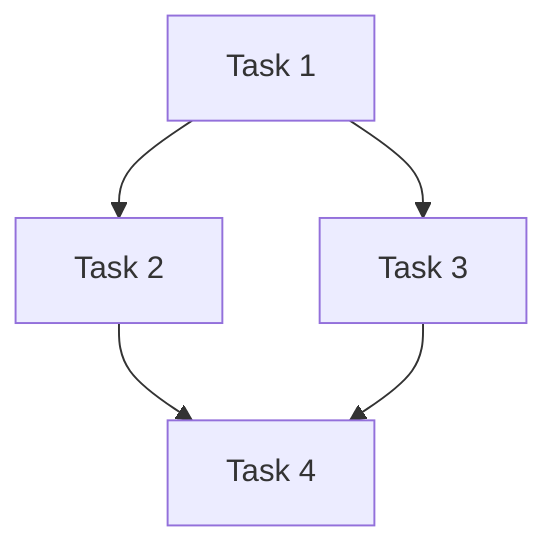

# Task-Decomposer Skill

Transform vague requests into clear, executable plans.

---

## When to Trigger

- Request is vague ("make it better", "fix the issues")
- Request spans multiple files or systems
- Request has unclear acceptance criteria
- Effort estimate is L or XL
- You're unsure where to start

---

## Decomposition Process

### 1. Clarify the Goal
Ask yourself:
- What is the user actually trying to achieve?
- What would "done" look like?
- Are there hidden requirements?

### 2. Identify Components
Break into independent pieces:
- Frontend changes
- Backend/database changes
- Configuration changes
- Documentation updates

### 3. Define Dependencies


### 4. Create Subtask List
Format for task file:
```markdown
## Implementation Plan
- [ ] Subtask 1 (dependency: none)
- [ ] Subtask 2 (dependency: 1)
- [ ] Subtask 3 (dependency: 1)
- [ ] Subtask 4 (dependency: 2, 3)
```

### 5. Estimate Effort
| Size | Criteria |
|------|----------|
| XS | < 30 min, single file |
| S | 30 min - 2 hr, 1-3 files |
| M | 2-4 hr, multiple files |
| L | 4-8 hr, multiple components |
| XL | > 8 hr, consider splitting |

---

## Decomposition Template

```markdown
## Task Decomposition: [Original Request]

### Interpreted Goal
[What I understand the user wants]

### Clarifying Questions (if any)
1. Question 1?
2. Question 2?

### Components Affected
- [ ] Component A
- [ ] Component B

### Proposed Subtasks
1. **[Subtask 1]** - [Brief description] (effort: S)
2. **[Subtask 2]** - [Brief description] (effort: M)

### Risks/Unknowns
- Risk 1
- Unknown 1

### Recommended Approach
Start with subtask X because...
```

---

## Decision Points

| If... | Then... |
|-------|---------|
| Request is clear and small | Skip decomposition, start coding |
| Request is clear but large | Decompose into subtasks |
| Request is vague | Ask clarifying questions first |
| Request has dependencies | Map dependencies before starting |

---

## Integration

- Run before starting any L/XL effort task
- Output goes into task file's Implementation Plan
- Triggers research-deep-dive if unknowns identified
